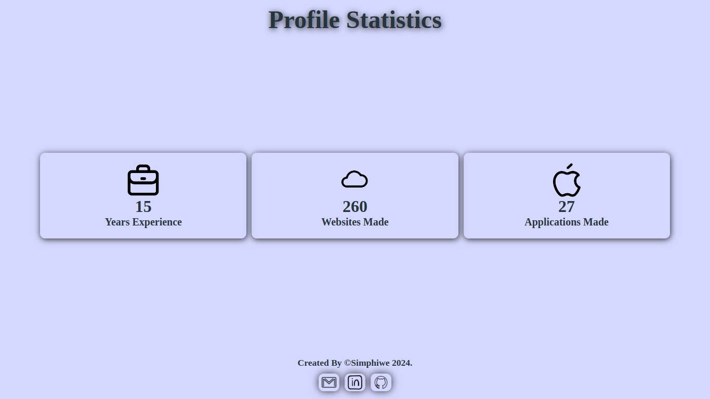

# **Profile Statistics**

A **_Profile_** web application with a modern feel and look, structured with **_HTML_**, styled with **_CSS_** and uses **_JavaScript_** for interactive.

## Screenshot

Check it _**LIVE**_ 👉
**<https://deebest.github.io/age-calculator/>**

## Uses

- Can be used to display the amount of experience you.
- Can also display the number of websites and applications you made.
- when the page is loaded the counters start from the smallest counter until the maximum

## Tech Stack Used

- GIT
- HTML
- CSS
- JavaScript

## Get In Touch 👇

Email : **<simphiwedladla8@gmail.com>**

Linked: **<https://www.linkedin.com/in/dladla-simphiwe-89061a20a/>**

Github: **<https://github.com/DeeBest>**

Portfolio: **<https://deebest.github.io/personal-webpage/>**
